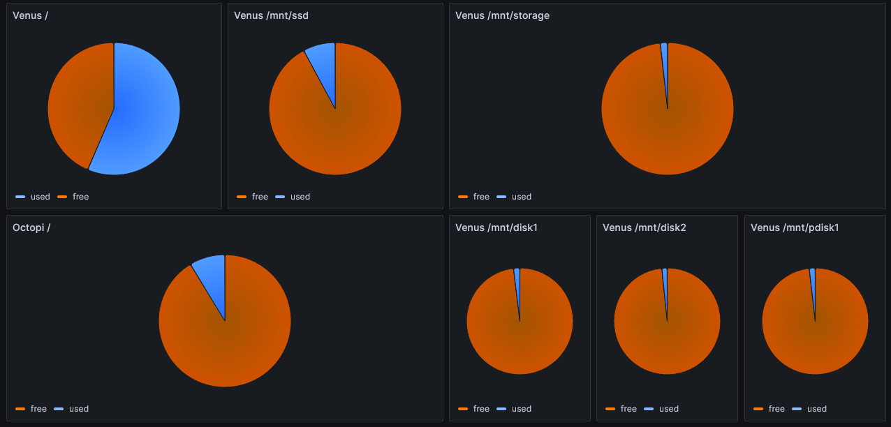

# Grafana

[Grafana](https://grafana.com/) is the visualization tool used in the homelab to monitor system health as well as environmental data in the home. Backed by TimescaleDB with data fed from Telegraf enabled nodes it provides an easy tool to see changes in the system and home environments over time. TimescaleDB enables additional functionality to better manage timeline specific data. Grafana dashboards are configurable to display any specific machine as well as different time ranges.


Grafana obtains its data from the homelab TimescaleDB instance. This is a PostgreSQL database with the Timescale plugin enabled. Tables are generated with Timescale properties to help accelerate querying as part of the Telegraf setup. $__timegroupAlias and $__timeFilter are Grafana properties that allow configuration within the dashboard (such as desired time interval) to be passed onto the queries. For example:

```SQL
SELECT
  $__timeGroupAlias("time",$__interval),
  host AS metric,
  avg(temp) as "CPU"
FROM temp
WHERE
  $__timeFilter("time")
  and sensor in ('cpu_thermal', 'k10temp_tctl')
GROUP BY "time", host
ORDER BY "time", host
```

I also use it as a dashboard to monitor current disk space within the homelab:

Grafana also visualizes changes in the home environment from the [[Sensor]] nodes which provide some basic [[Environmental Monitoring]] data:


A final dashboard is present to monitor the functioning of the my Pihole instances. This queries the [JSON api](https://github.com/pi-hole/web/blob/master/api.php) provided by pihole. This is interpreted via the [Grafana Infinity](https://github.com/yesoreyeram/grafana-infinity-datasource) plugin and queried via its unique, but fairly straightforward syntax:

```UQL
parse-json
| project kv("domains_over_time")
| project "host"=tostring('Primary'), "time"=unixtime_seconds_todatetime("key"), "Domain Requests"=tonumber("value")
```

This is queried from each pihole (Pihole1 and Pihole2) and rendered as a stacked bar graph for easier interpretation.


Links:

- [Grafana](https://grafana.com/)