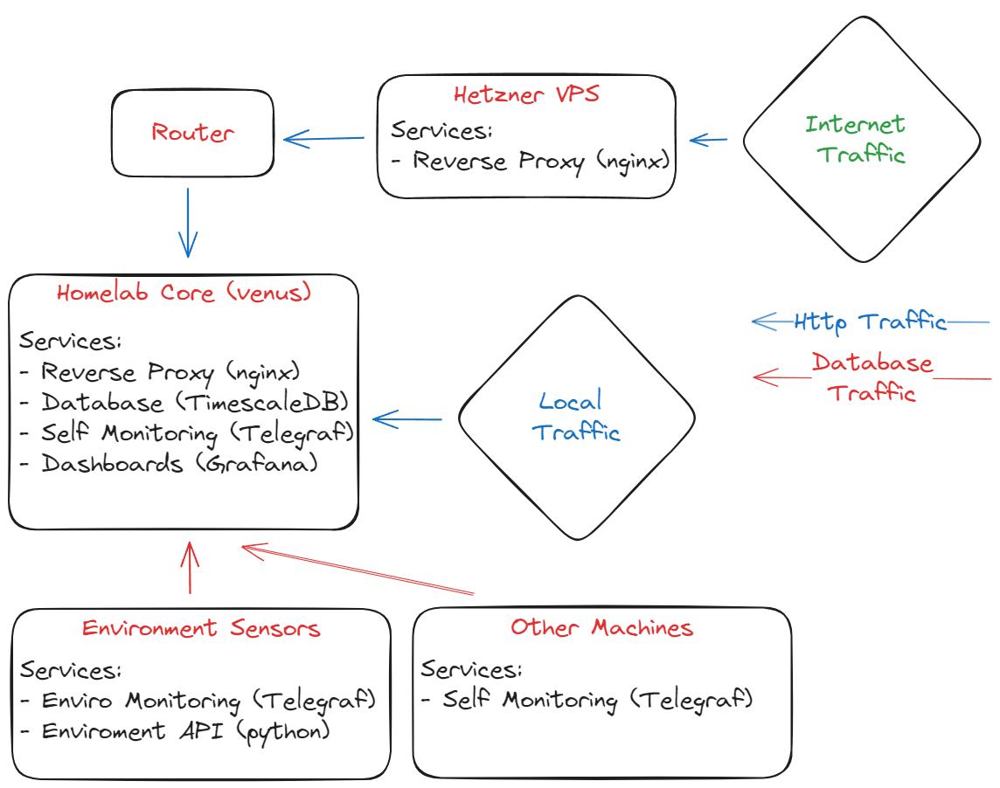

## Monitoring Environment setup

This repository serves as a code example for how I have my homelab monitoring environment set up. It is extracted from a private mono-repo that I have set up to match my environment. The mono repo contains sensitive information which has been sanetized for this repository. This repository also includes additional notes in the code to help point out specific aspects.

#### Machine configuration

My homelab environment monitoring looks something like this:

### Explanation of roles:

Homelab Core is a more powerful box than most of the rest of my prior hardware (Raspberry Pi's) it acts as the primary HTTP server, Database, and runs the core services for my homelab. Most services are run within docker containers and could, if necessary, be moved to other machines allowing for expandability later. These docker containers are specified in `docker-compose.yml` files within their respective projects allowing me to source control this configuration.

HTTP traffic ingress is handled by nginx and routed to the docker containers. Docker networks are used to isolate network traffic to services as necessary, for example HTTP traffic cannot be directed to the database. A remote hetzner VPS manages ingress traffic to my home IP for three reasons; it masks my public IP addressm it allows me to control access to what services should be externally accessible, and Telus won't let me serve traffic on port 80 from my home connection making automated HTTPS redirects not possible. The internal Nginx also acts as my HTTPS termination endpoint, traffic from the external Hetzner proxy remains HTTPS encrypted.

The database is a Posgresql instance with the TimescaleDB plugin installed. This allows for normal operation for other services to use vanilla posgres, but allows me to apply timescale specific properties to tables that hold telegraf data such as automated compression.

Monitoring for general services (cpu temp, hdd space, memory allocation etc) is provided by telegraf running in a docker container on both the main server and each sattelite machine. This is augmented on the environment sensors with a JSON api written in Python that reads sensor data and provides it to telegraf for logging to the DB. This lets me centralise my logging around telegraf but gives me customisability in how the sensors are accessed. The sensors are often time-sensitive in terms of poll rate and can result in errors if not correctly used, this is handled by the json API by caching sensor results and providing them indirectly to the Telegraf polling.

Deployment is handled via Ansible playbooks with additional automation provided by Ansible Semaphore and Teamcity (not fully included here). These playbooks are configurable with environment variables using a per-system environment file in the projects folder `/projects/monitoring-enviro/hosts` and the use of ansible's templating. Additionally the idempotent nature of ansible tasks allows me to configure database and users that should be present in order for the monitoring to function correctly.

Finally, in order to make use of the monitored data a Grafana instance runs on the homelab core and makes use of the nginx ingress to provide web traffic. Currently this is only internally accessible as it is not set up on my internal ingress. I've added more information into [Grafana.md](./grafana.md). Grafana could also be used for alerting for major changes in either hardware or environment sensors however I have not yet set this up.

## Hardware:

### Homelab Core:

Beelink SER5 5800H
- Architecture: AMD64 (Ryzen 5800H)
- 64GB RAM
- 512GB SSD (Primary/OS)
- 2TB SSD (Secondary/Working)
- External 5 Bay USB-C SATA Caddy, currently 3x 12TB HDD (Bulk Storage, Expandable)

#### Containers

| Container Name | Project Directory |
| --- | --- |
| nginx | projects/home-ingress-nginx | 
| telegraf | projects/monitoring-server |
| grafana | projects/monitoring-server |
| timescaledb | projects/timescaledb | 

### Environment Sensors:

Raspberry Pi 4b
- Architecture: aarch64 (Cortex-A53)
- 128GB SD Card
- 4GB RAM
- Enviro+ Air Quality PI Hat
- PMS5003 Particulate matter sensor

### Containers

| Container Name | Project Directory | 
| --- | --- |
| enviro_plus_flask | projects/monitoring-enviro/source |
| telegraf | projects/monitoring-enviro/files |

## Useful Links:

Timescale: https://www.timescale.com/

Postgresql: https://www.postgresql.org/

Nginx: https://nginx.org/en/

Grafana: https://grafana.com/

Telegraf: https://www.influxdata.com/time-series-platform/telegraf/

Ansible Semaphore: https://www.ansible-semaphore.com/

Teamcity: https://www.jetbrains.com/teamcity/
